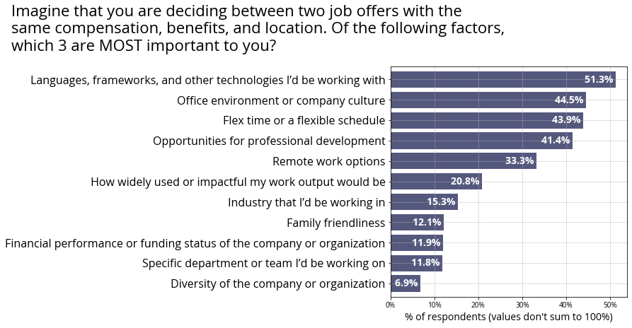
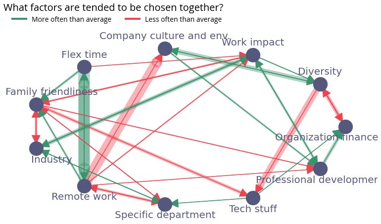
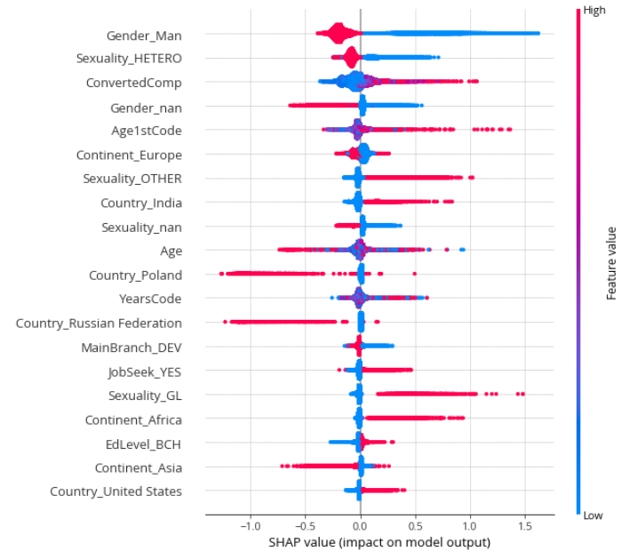

<p align="center"> </p>

# What impacts developers' job preferences? - StackOverflow Survey 2020 Summary 


Welcome to repository created on purpose of 
[the article I posted recently on medium.com](https://kmwolowiec.medium.com/what-impact-the-developers-job-preferences-2384ec4b596d)


## Motivation
Job preferences are used to be considered in terms of wages, locations and benefits. But what happens when we have to choose
between offers having similar each of them? What does matter then and why? This question started to bother me for a while,
so I decided to finally find the answer. 

Fortunately, this also probably bother StackOverflow team - that's why the question regarding the job factors is included into 
the StackOverflow Survey. I decided to use survey data to find the answer. 

**I have explained what are the developers job preferences and what are the patterns in developers choices.**

**Moreover, by using Machine Learning alghorithms I attempted to explain what features impact on those preferences.**


## Sources
Surveys conducted by StackOverflow are a great source of information regarding developers job situation and their expectations.
Dataset used in the analysis comes from **The Public 2020 Stack Overflow Developer Survey Results**, 
fielded between 5th and 28th of February 2020 on StackOverflow users.
 
The survey data are available on: https://insights.stackoverflow.com/survey. The dataset consists of about 
Provided dataset consists of 61 features and about 65k rows, where each row stands for unique respondent.

## Files
The structure of the repository is as follows:
```
- data/
    - README_2020.txt
    - so_survey_2020.pdf            # PDF file of survey instrument
    - survey_results_public.csv     # Survey results dataset
    - survey_results_schema.csv     # Survey schema, the questions that correspond to column names
- img/                              # Images used in the article
- analysis.ipynb                    # The analysis
- environment.yml                   # Conda environment configuration file                      
 ```

## Environment
If would You like to reproduce the analysis, I recommend You to use environment I provided, using 
[conda](https://docs.conda.io/projects/conda/en/latest/user-guide/install/index.html).
Environment configuration file is stored in `environment.yml` file. 
If You have already conda installes, just hit:
```
> conda env create -f environment.yml
> conda activate jobfactors_py38
```

> Note: I was working on Windows. Some packages may require specific versions when working on other OS.
<style>
[src*="#thumbnail"] {
   width:80px;
    vertical-align:middle;
    horiz-align: right;
}

center {
    align: center;
}


</style>


## Libraries 

I used standard Data Pythonist tool kit:

* Wrangling: numpy, pandas, scipy      

* Visualization: matplotlib, seaborn        

* Modelling: scikit-learn, xgboost, catboost

* Explaining: shap

* Others: networkx, cycler, warnings, typing, warnings
<p align="center">
     
     
     
     
    
     
     
    
    
</p>

And last, but not least: **jupyter** 
(using jupyter lab introduced some undefined behaviour of environment management, so I decided to stay in **jupyter notebook**)

<p align="center"></p>

## Results & conclusions

### 1. What are the top important factors for individuals when seeking job?
For over 1/2 of respondents, **Languages, frameworks and technology** are the most common factor when taking a job offer. 

The second and third places are the **Office environment or company culture** and **Flexible schedule**. 
A similar number of respondents have chosen also **Opportunities for professional development**. 
These four emerged as dominant among others.

On the lower side of the list, we have just about 7% of respondents that picked the **Diversity** of the company or organization as the most important factor when taking a job offer.
<p align="center"></p>

### 2. Which factors tends to be chosen together and why? Are there any patterns in respondents choices?
Based on standardized percentage of respondents choices it was possible to handle
factors that tends to be chosen together or not.
 
There are at least 4 major patterns identified based on respondents choices:

* **Individuals that pick “Family friendliness” tend to care less about career-related factors.** 
They are less likely to pick at least one of the following: “Specific department”, “Tech stuff”, “Professional development”, and “Industry ”.

* As a contrary to above, **those who picked “Work impact”, are more likely to pick also “Industry” or “Professional development”.**

* **Those who pick “Diversity” tend to care more about company culture and office environment**, 
while less about “Organization finance” and “Tech stuff”. 
Actually, that's what we expected since diversity and inclusion are the important values of many companies so
it's natural respondents cares about company culture.

* Last but not least, there are similarities between respondents that chosen “Flex time” and “Remote work options”. 
The group of developers choosing these options could consist of persons that require convenience and comfort regarding the work time organization. 
Respondents choosing these two are overlapping much, that’s why “Family friendliness” occurs in both as the factor they tend to chose more likely, 
while they both less often care about their impact on the reality, which confirms the hypothesis ‘Convenience first’.

<p align="center"></p>


### 3. What impact respondents' choices?
Based on mutiple [XGBoost](https://xgboost.readthedocs.io/en/latest/) models (separate model for each job factor), 
I attempted to identify features that impacts respondents choices. 
Here's the example of [SHAP values](http://papers.nips.cc/paper/7062-a-unified-approach-to-interpreting-model-predictions.pdf) 
for "Diversity of the company and organization":
 
<p align="center"></p>


> Shapley Values are extremely easy to interpret. Here are the rules You should follow to interpret the graph Yourself:
> * Each dot stands for separate respondent.
> * The color stands for feature value. Red - high values of a feature (high salary, elder age), blues represents the low values.
> Note that binary variables could take only two values: 1 and 0. So 1 is red, 0 is blue. `Gender_Man` is example of such a feature.
> In this case red represents respondents that chose gender `Man`. Blue - respondents that aren't male.
> * The model consists of about ~50 features and the only most important are presented on the graph. 
> However, features are ordered from the greatest to the least important.
> * On X axis there is a impact on our prediction.

So what does the graph tell us? What decides of choosing or not, Diversity as important factor?:
* Being a Men as well as hetero influences negatively to the model output.
* Compensation is the third most important feature - greater compensation results in a greater probability of choosing "Diversity".
* Developers from India and Unites States are more tended to choose diversity than Polish and Russian developers.

> Disclaimer: The analysis is not aimed to offend or insult anybody. Be smart when interpreting the results. 
> Model is a generalization of the reality - and it's just the generalization. Our world and societies are much more
> diversed. We are responsible for getting the right insights from the data. The fact somebody didn't choose diversity, 
> doesn't mean at all he's not respectfull. This would be the worst possible conclusion. 

 